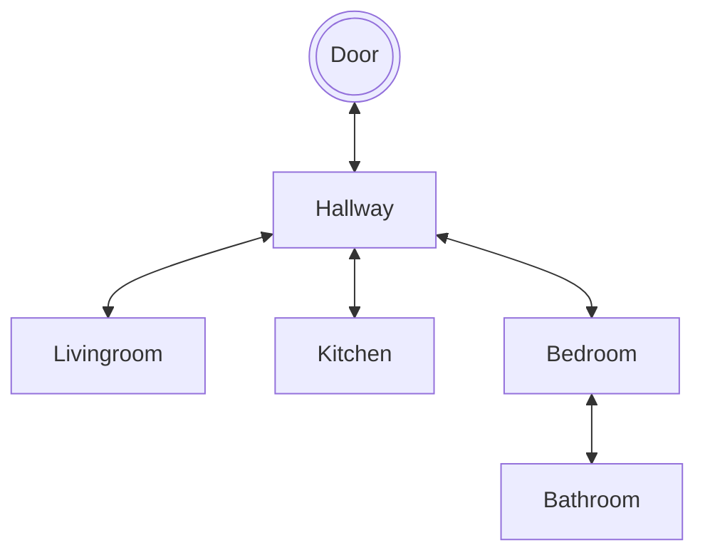

# Setting
- You are lost, you are in a house. The only way out is by finding the key and leaving through the door. Good luck finding the key!

# Map

# Story
- You wake up, you have no idea where you are. You are in a old house, you try leaving but you don't have the key. Good luck finding it

# Global Variables
- The most important variables are listed below
- keyInHand - what is needed to open the door
- doorOpen- Completing the game
